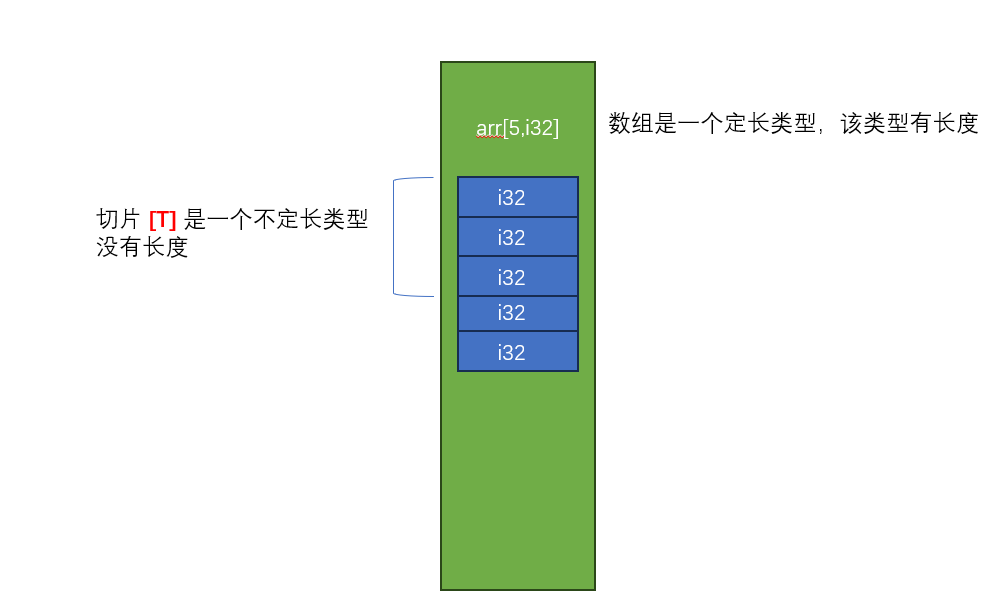

# 再谈类型

我们已经学习过了几乎所有RUST关于类型的定义，本节将针对类型的其他注意点以及使用方法 做更近一步阐述


### 类型别名

并非RUST有类型别名，甚至C里面都有类型别名`typedef` 相比较C语言，RUST类型别名更具有泛型的特点

应用场景1，类型别名可以缩短代码

```
struct ParsePayLoad<T> {
	inner: T
}

struct ParseError<E> {
	inner: E 
}

fn parse_payload<T,E> (stream: &[u8])-> Result<ParsePayLoad<T>,ParseError<E>> {
	unimplemented!();
} 
```

我们可以看到，上面的代码`parse_payload` 函数签名已经很长了，这时候可以使用类型别名

```
type ParseResult<T,E> = Result<ParsePayLoad<T>,ParseError<E>>;

fn parse_payload<T,E> (stream: &[u8])-> ParseResult<T,E> {
	unimplemented!();
} 
```

标准库中也大量使用了类似的方法，比如File模块的 关于Result重定义


### 不定长类型

我们前面介绍过的类型，几乎都是定长类型(类型的大小是确定的)，RUST中也有两种不定长的类型 

 - [T] : 切片类型，切片类型代表一个内存的不可变视图
 
 

 - dyn Trait: 特征对象类型
 
上述两种类型都无法直接使用(不定长类型变量内存大小无法确定) 因此只能通过他们的引用使用

 - 任何把不定长类型作为最后一个字段的结构体 也被视为不定长类型

对于不定长类型 我们只能以引用的方式使用，引用包含了指向内存的地址，以及内存的长度


### Sized&?Sized

`Sized` 特征是一个标记特征，标识某个类型是内存大小确定的，对于不定长类型，需要通过`?Sized` 标记，显示告诉编译器，该类型不对大小
已知做限制，RUST 会为所有类型默认添加`Sized`约束


 
### 联合
联合是C里面的类型，RUST为了和C语言交互，也支持了union类型 该类型直接映射C语言的实现 

```
union Metric {
	rounded: u32,
	precise: f32,
}

fn main(){
	let mut a = Metric {rounded: 323};
	
	unsafe {
		println!("{}",a.rounded);
		println!("{}",a.precise);
	}
	a.precise = 33.3;
	
	unsafe {
		println!("{}",a.rounded);
		println!("{}",a.precise);
	}
}

```

### 全局值

我们已经讲过 在程序中有三个内存地址的变量: 栈、堆、BSS段，前两个我们已经见过了，今天看第三个数据区的变量

常量: 常量的值在内存中是不可变的，语法为 `const NAME（大写） : T  = value ` 常量在任何时候使用 都是以内联形式使用


静态值: 静态值对应C里面的 `全局变量`,既然是变量 那就可以修改
```
static mut BAZ: u32 = 4;
static FOO: u8  =122;


fn main(){
	unsafe {
		println!("baz is {}",BAZ);
		BAZ= 100;
	}
}
```

### 类型转换

强制类型转换是一种将类型 降级或者升级到其他类型的机制。 当类型转换隐式发生时，被称为强制类型转换。RUST 还允许各种级别的
类型转换，要执行简单的类型转换，我们使用关键字`as`

```
let a = 34u8;
let b = a as u64;
``` 

除了简单的基元类型，也可以把某些实现了`特征`的类型，转为特征对象 

```
use std::fmt::Display;

fn show_me(item: &dyn Display) {
	println!("{}",item);
}

fn main() {
	let a = "abc";
	show_me(&a);
	let c = &a as &dyn Display;
}
```

另外还有可以从引用转为原始指针，我们之前已经见识过了

除了使用`as`进行隐式的类型转换，还有一种更加安全和通用的方法 通过 `from/into` 特征  

```
pub trait From<T>: Sized {
    // Required method
    fn from(value: T) -> Self;
}
pub trait Into<T>: Sized {
    // Required method
    fn into(self) -> T;
}
```

一个示例

```
#[derive(Debug)]
struct Apple(i32);

impl From<i32> for Apple {
    fn from(value: i32) -> Self {
        Apple(value)
    }
}

impl Into<i32> for Apple {
    // Required method
    fn into(self) -> i32 {
        self.0
    }
}

fn main() {
    let apple = Apple::from(10);
    println!("{:?}", apple);

    let size: i32 = apple.into();
    println!("{}", size);
}
```
