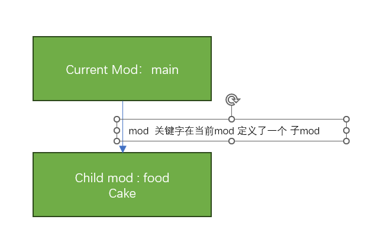
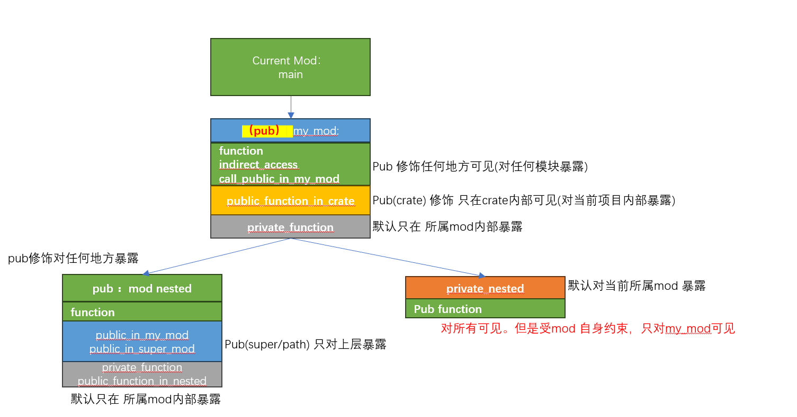
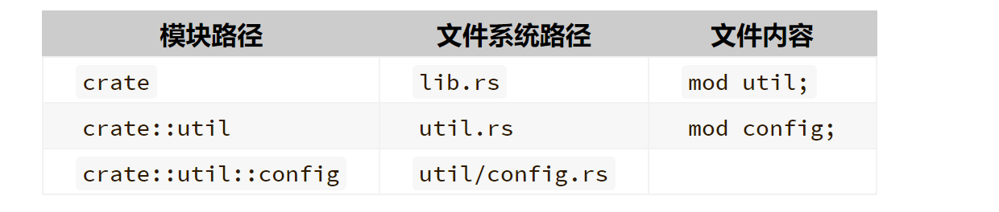

# 模块

在正式进入正题之前，还是让我们先看看诉求 


在任何一门语言中，项目中都需要管理代码 

 - C的可执行文件: C语言习惯把不同的源文件 按照功能和模块拆分为不同的源文件和头文件，头文件作为该模块对外提供的声明；从而实现
   个模块之前的不同调用；最终在通过链接器，链接成一个完整的二进制文件；
 - C的库文件:   对于库文件，和二进制基本相同，只是不需要链接的过程，而是把源文件打包即可，当有二进制文件要使用库文件，
    需要使用库文件提供的头文件，最终在使用打包的库文件 完成链接的动作

 - Python: 我们应该都知道 python 习惯通过import 导入其他模块 
 
每种语言在代码组织以及发布形式上 都有各自语言的特色，本节主要讲 RUST 是如何管理代码的
 
### mod关键字
先让我们从模块概念讲起 

 - mod 定义了一个模块的命名空间 
 - mod 中可以定义类型、函数(代码项)
 - 使用模块中的内容 使用 modname:: 访问
 - mod 可以嵌套

一种最简单的模块定义:

```
//在任意目录下创建一个 xx.rs  修复下列代码

mod food {
	pub struct Cake;
	struct Pizza;
}

fn main(){
	let cake = food::Cake;
}
```




### 模块可见性原则
就如同其他语言中的 static/private，有些API和变量 我们不希望被外部模块看到，只会在模块内部使用，
RUST 利用 `pub` 关键字特性来实现对模块内 程序项的保护 

在一个大型代码项目中，代码一般按照 子系统->子模块->子功能的形式组织，C语言一般会通过 include 路径用来表示这种关系
RUST 通过提供更加丰富的 `pub(self/super/crate)`语义来表达这种关系 

 
 - 模块内部的程序项默认都是不可见的 (`pub(self)`)
 - 同一个模块内部，程序项都是互相可见的 不需要pub声明
 - `pub` 是最简单的可见性控制，在模块内 pub 声明，则该程序项 在内外 crate(关于crate 稍后再讲)都可见 
 - 模块可以嵌套，同时模块也可以使用 `pub`关键字声明可见性
 - 使用 `pub(in path)` 语法定义的函数只在给定的路径中可见。
   `path` 必须是父模块（parent module）或祖先模块（ancestor module）向上可见性 
 -  `pub(super)`： 几乎等于 `pub(in path)`的一个特定情况，只在父模块可见 
 - `pub(crate)`： 在crate 内部整体可见，crate外部不可见 
 - `mod` 内部程序项的可见性 首先受`mod` 自身可见性约束 



```
// 一个名为 `my_mod` 的模块
mod my_mod {
    // 模块中的项默认具有私有的可见性
    fn private_function() {
        println!("called `my_mod::private_function()`");
    }

    // 使用 `pub` 修饰语来改变默认可见性。
    pub fn function() {
        println!("called `my_mod::function()`");
    }

    // 在同一模块中，项可以访问其它项，即使它是私有的。
    pub fn indirect_access() {
        print!("called `my_mod::indirect_access()`, that\n> ");
        private_function();
    }

    // 模块也可以嵌套
    pub mod nested {
        pub fn function() {
            println!("called `my_mod::nested::function()`");
        }

        #[allow(dead_code)]
        fn private_function() {
            println!("called `my_mod::nested::private_function()`");
        }

        // 使用 `pub(in path)` 语法定义的函数只在给定的路径中可见。
        // `path` 必须是父模块（parent module）或祖先模块（ancestor module）
        pub(in crate::my_mod) fn public_function_in_my_mod() {
            print!("called `my_mod::nested::public_function_in_my_mod()`, that\n > ");
            public_function_in_nested()
        }

        // 使用 `pub(self)` 语法定义的函数则只在当前模块中可见。
        pub(self) fn public_function_in_nested() {
            println!("called `my_mod::nested::public_function_in_nested");
        }

        // 使用 `pub(super)` 语法定义的函数只在父模块中可见。
        pub(super) fn public_function_in_super_mod() {
            println!("called my_mod::nested::public_function_in_super_mod");
        }
    }

    pub fn call_public_function_in_my_mod() {
        print!("called `my_mod::call_public_funcion_in_my_mod()`, that\n> ");
        nested::public_function_in_my_mod();
        print!("> ");
        nested::public_function_in_super_mod();
    }

    // `pub(crate)` 使得函数只在当前 crate 中可见
    pub(crate) fn public_function_in_crate() {
        println!("called `my_mod::public_function_in_crate()");
    }

    // 嵌套模块的可见性遵循相同的规则
    mod private_nested {
        #[allow(dead_code)]
        pub fn function() {
            println!("called `my_mod::private_nested::function()`");
        }
    }
}

fn function() {
    println!("called `function()`");
}

fn main() {
    // 模块机制消除了相同名字的项之间的歧义。
    function();
    my_mod::function();

    // 公有项，包括嵌套模块内的，都可以在父模块外部访问。
    my_mod::indirect_access();
    my_mod::nested::function();
    my_mod::call_public_function_in_my_mod();

    // pub(crate) 项可以在同一个 crate 中的任何地方访问
    my_mod::public_function_in_crate();

    // pub(in path) 项只能在指定的模块中访问
    // 报错！函数 `public_function_in_my_mod` 是私有的
    //my_mod::nested::public_function_in_my_mod();
    // 试一试 ^ 取消该行的注释

    // 模块的私有项不能直接访问，即便它是嵌套在公有模块内部的

    // 报错！`private_function` 是私有的
    //my_mod::private_function();
    // 试一试 ^ 取消此行注释

    // 报错！`private_function` 是私有的
    //my_mod::nested::private_function();
    // 试一试 ^ 取消此行的注释

    // Error! `private_nested` is a private module
    //my_mod::private_nested::function();
    // 试一试 ^ 取消此行的注释
}

```

### 结构体的可见性

结构体的字段也是一个可见性的层次。字段默认拥有私有的可见性，也可以加上 pub 修饰语来重载该行为。
只有从结构体被定义的模块之外访问其字段时，这个可见性才会起作用，其意义是隐藏信息（即封装，encapsulation）。

```
mod my {
    // 一个公有的结构体，带有一个公有的字段（类型为泛型 `T`）
    pub struct OpenBox<T> {
        pub contents: T,
    }

    // 一个公有的结构体，带有一个私有的字段（类型为泛型 `T`）    
    #[allow(dead_code)]
    pub struct ClosedBox<T> {
        contents: T,
    }

    impl<T> ClosedBox<T> {
        // 一个公有的构造器方法
        pub fn new(contents: T) -> ClosedBox<T> {
            ClosedBox {
                contents: contents,
            }
        }
    }
}

fn main() {
    // 带有公有字段的公有结构体，可以像平常一样构造
    let open_box = my::OpenBox { contents: "public information" };

    // 并且它们的字段可以正常访问到。
    println!("The open box contains: {}", open_box.contents);

    // 带有私有字段的公有结构体不能使用字段名来构造。
    // 报错！`ClosedBox` 含有私有字段。
    //let closed_box = my::ClosedBox { contents: "classified information" };
    // 试一试 ^ 取消此行注释


    // 不过带有私有字段的结构体可以使用公有的构造器来创建。
    let _closed_box = my::ClosedBox::new("classified information");

    // 并且一个结构体中的私有字段不能访问到。
    // 报错！`content` 字段是私有的。
    //println!("The closed box contains: {}", _closed_box.contents);
    // 试一试 ^ 取消此行注释
}
```


### 文件mod 
从上面可以看到: mod从形式上看是一个 层层递进的树形解构 OK？

树形解构天然的又可以转换成目录解构，我们尝试把上面的mod 解构转换为文件目录解构 

没有代码体的模块是从外部文件加载的。当模块没有 path 属性限制时，
文件的路径和逻辑上的模块路径互为镜像。祖先模块的路径组件(path component)是此模块文件的目录，
而模块的内容存在一个以该模块名为文件名，以 .rs 为扩展文件名的文件中。
例如，下面的示例可以反映这种模块结构和文件系统结构相互映射的关系：




注意点: 
 - 如果mod 使用的是 `mod_name/mod.rs` 则mod.rs中 引入的mod 会在 `mod_name/*.rs `下寻找(或者去下一级目录)
 - 如果mod 使用的是 `mod_name.rs` 导入的，则引入的mod也会在 `mod_name/*.rs` 下寻找(或者去下一级目录)

总之，如果要定义一个mod，一定要知道当前mod是在什么文件中

项目演练:

```
 --- moddemo //创建一个项目文件夹 moddemo 
   - main.rs // 存放main函数 
   - my_mod.rs // 用来存放 mod my_mod中的程序项 
   - my_mod // 创建my_mod目录
     - nested.rs // mod nested 的程序项 
	 - private_nested.rs // mod private_nested 的程序项 
```

问题: 如何在 mod nested中使用 mod  private_nested ？ 

 - 在nested 中 定义 mod private_nested?  
 - 使用use？在学习完use 之后
 - 使用super? 


### 扩展: 模块属性 
模块和所有程序项一样能接受外部属性。它们也能接受内部属性：
可以在带有代码体的模块的 { 之后，也可以在模块源文件的开头（但须在可选的 BOM 和 shebang 之后）。

在模块中有意义的内置属性是 cfg、deprecated、doc、lint检查类属性、path 和 no_implicit_prelude。
模块也能接受宏属性。

最常用的路径属性：


