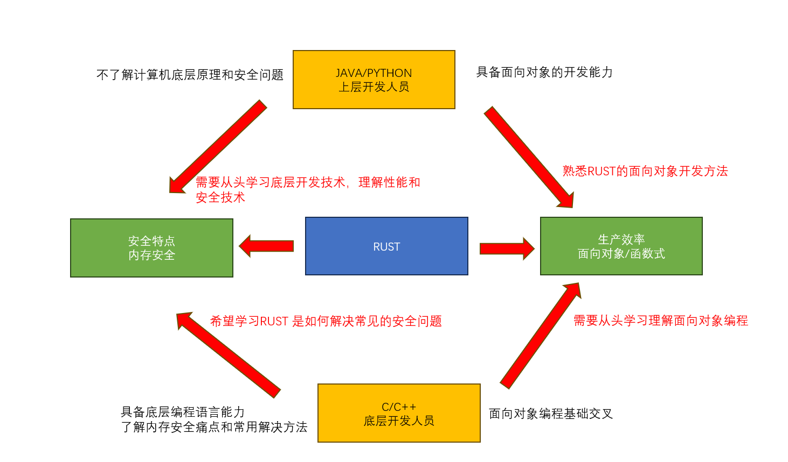

# 介绍

### 关于笔记
网上已经有非常多的关于RUST学习的书籍和资料，但是作者自己以前是做C语言开发的,在自学过程中
发现很多资料都在强调或者演示 RUST的基本语法以及一些库函数的使用(比如String Vec)，但是我自己认为
RUST不应该是这样学习的，把RUST仅仅作为面向对象的语言讲是不合适的，把所有权作为RUST 语法讲是不合适的  

因此，我希望按照自己的思路记录我学习RUST中间的心得和体会

### 谁应该读？
面向有经验的底层C语言开发者 

本笔记不会过多介绍其他概念，比如栈、堆这些知识，建议读者具备一定的底层开发基础 

 - 需要学习过 C/C++至少一门语言
 - 需要使用过 java/python/C++至少一门语言，又或者对于面向对象的概念有所熟悉
 - 学习过计算机原理更好
 - 学习过汇编更好

### 资料参考

 - [RUST权威指南](https://rustwiki.org/zh-CN/book/)
 - [RUST语言圣经](https://course.rs/about-book.html)
 - 精通RUST(第2版)
 - [RUST参考手册](https://rustwiki.org/zh-CN/std/primitive.char.html)
 
### 环境

 - [在线平台:playground](https://play.rust-lang.org/) 初级阶段 可以在线验证知识点，加深理解
 - 本地环境: 参考 https://rustwiki.org/zh-CN/book/ch01-01-installation.html

### 版本介绍

 - 夜间版(nightly): RUST 开发分支每天晚上会发布当天日构建版本(功能总是最新的 也意味可能是不稳定的)
 - 测试版本(beta)：下一个稳定版本发布之前的预览版本 大概6周发布一次
 - 稳定版本(stable)：测试版本测试稳定后的正式版本， 大概6周发布一次

rustup 用于管理本地rust工具链版本: 

 - rustup update: 升级本地工具链到最新版本
 - rustup self update: 升级rustup自己
 - rustup show: 查看本地工具链版本以及默认选择
 - rustup ovveride set (nightl/version): 设置特定目录使用特定工具链版本

