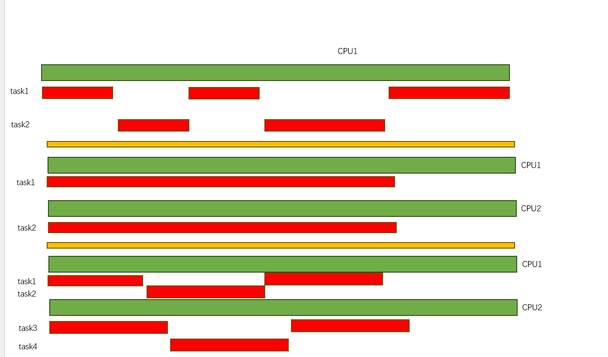
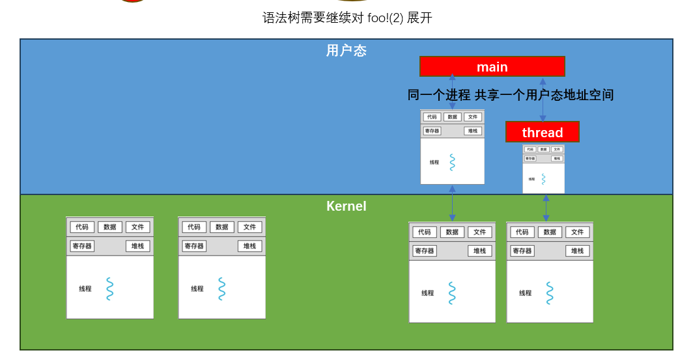

# 前置基础

考虑到每个人基础可能会不一样， 在继续了解RUST关于并发支持前 先简单介绍一下背景知识


### 并行&并发

 

并行: 任务在不同的CPU上 可以在同一时间运行
并发: 任务在同一个CPU上 交替执行，让用户感觉是在一起执行 

在现在的计算机领域，事实上 并发和并行 往往现在是同时存在的 


在继续下一个小姐之前，请回答下列问题： 

 - 为什么会有多CPU系统？
 - 实现并发并行的操作系统主要计数有哪些？


### 缺陷

OK，我们要讲一下 在多任务场景下可能带来哪些问题(我觉得大家都知道....)

 - 多任务访问 同一个内存区的竞争问题 
 - 死锁问题
 - 锁优先级反转问题
 - ....
 
 

### 线程基础

此处的线程库默认为 应用态的线程库，可能和内核的线程库不相同，仅作为一个参考 

linux 内 有几种线程概念，容易被混淆 

 - 内核线程: 内核线程的生命周期 只在内核内部管理，内核线程不会跑到用户态执行
 - 用户态的主线程: 我们也习惯把它叫做用户态的进程，每个进程创建，会伴随着一个用户态地址空间的创建 
 - 用户态的线程: 用户态的线程 和主线程共享用户态空间
 - 每一个用户态线程 最终再内核都有一个对应的内核线程 


 
 
rust中简单创建一个线程 观察运行结果

```
use std::thread;

fn main() {
	thread::spawn(|| {
		println!("Thread!");
	});
	
	println!("main exit");
}

```

我们是操作系统开发工程师，上面问题当然难不倒我们，创建thread 可以有多种模式，默认时分离创建，那么
子线程的运行不会依赖主线程 因此: 

一旦从主线程返回，主线程直接退出，可能子线程此时并没有来得及调度就被销毁，因此 一般情况 需要主线程等待
子线程

```
use std::thread;

fn main() {
	let child = thread::spawn(|| {
		println!("Thread!");
	});
	
	child.join().expect("Failed join child thread");
	println!("main exit");
}

```


### 线程中的数据访问

一般情况，子线程都需要和父线程进行数据交互，

说一下为什么下面代码会报错 并修复它
```
use std::thread;

fn main() {
	let nums = vec![1,2,3,4];

	for n in 0..4 {
		let child = thread::spawn( || {
			println!("Thread num: {}", nums[n]);
		});
		child.join().expect("Failed join child thread");
	}
	println!("main exit");
}

```


