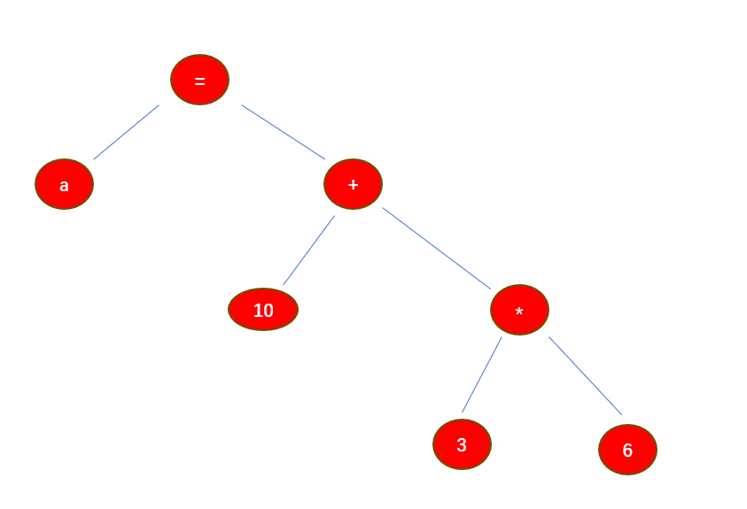

# 前置基础

本章 我们将一起探讨RUST中的宏和元编程  在正式开始之前，需要先对齐一些术语和知识


### 元编程

一个程序由什么组成？  

 - 数据: 数据可以在程序中的运行过程中不断变化
 - 指令: 操作数据的指令，指令对于程序 一旦生成之后, 不再可变


元编程: 把指令作为数据，从而可以通过 特定的代码， 处理`指令数据` ,然后生成新的代码

这个时候，指令变成了数据，从而让编程更加灵活(比如华为提出的 `元OS`，提出了一种设想，把`OS` 作为可编程的OS，用户可以
自定义 OS的功能作为输入，经过 `元OS`的解释，从而生成 满足不同功能的OS)

作为C语言工程师，如果为了实现上述功能，我们更习惯这样做: 

```
#ifdef SCHED_OTHER 
int sched() {
	//do sched_other stuff
}
#esif SCHED_XX 
int sched() {
	//do sched_other stuff
}
#endif
```

元编程的一部分思想体现在，编写能够 `生成新代码的代码`

```
macro create_sched(sched_type) {
	SCHED_OTTHER:  do sched_other stuff
	SCHED_XX:  do sched_xx stuff
} 
```

事实上 C语言的宏 也是一种最简单的 元编程的思想体现 

```
#include <stdio.h> 

#define SWITCH(a, b) { temp = b; b = a; a = temp;}

int main() {
	int x = 1;
	int y = 2;
	int temp = 0;
	SWITCH(x,y);

	printf("x :%d , y: %d temp %d \n",x, y,temp);
}


```

### 宏卫生

宏`卫生`: 当我们 用卫生这个词，其实是想说明，宏生成的代码是否会`污染` 当前代码，如果宏可能污染当前代码，就说它是`不卫生`

RUST 宏是卫生的，具体体现在: 

```
macro_rules! switch {
	($a:expr, $b:expr) => {
		temp = $b;
		$b=$a;
		$a=temp;
	};
}
fn main() {
	let (x,y,temp) = (1,2,0);
	switch!(x,y);

	println!("x :{}, y: {} temp {} \n",x, y,temp);
}
```

### 介绍编译器原理

如果感兴趣，更建议大家去学一下编译器相关课程，本节只是简单介绍一下编译器的工作方式 

无论什么编译器，他的工作都是把一个 `A语言` 翻译成 `B语言`

因此编译器始终围绕着语言工作，任何编程语言往往由这几个要素构成 

 - `词`: 是语言的最小单元，词又有 `关键字` `变量` `运算符号` 组成
 - `语法`: 词法规定了 `词`和`词` 的连接方式
 - `语义`: 如果要对翻译作更进一步的解释，还需要理解`语义`，在`语义`的基础上，编译器可以对代码重新优化
 
对应上面的几个元素，编译器一般的工作流程为: 

 - 词法分析： 使用词法分析器（lexical analyzer，或者叫扫描scanner，或者叫tokenizer），输入源代码，输出`token`流
 - 语法分析： 使用语法分析器，输入token流，输出抽象语法树AST。步骤一和步骤二统称为解析器（Parser）
 - 语义分析:  它会对AST进行语义分析，当发现禁止的语法规则后就会报编译错误
 - 代码生成:  目标代码通常是机器码（如Rust -> 机器码）、或中间表示/字节码（如Rust -> LLVM-IR或Java -> Java字节码）、
              或其他高级语言（如TypeScript -> JavaScript）


我们将对一行代码尝试上述规则的展开

```
fn main() {
	let a = 10 + 3 * 6;
}

```

第一步: 获得单个元素列表 [let, a, =, 10, +, 3,*,6];
第二步: 此法分析，获得抽象语法树，这一个步骤会根据 运算符优先级等 构建出 ATS语法树 




最后让我们回忆一下，C语言的宏展开是在哪一个部分实现的？  

C语言的宏是在`预编译`阶段单纯的`文本替换` ，并不会对整个编译过程产生影响


### Rust宏的展开阶段

RUST 宏是在抽象树构造阶段展开的 我将举例说明 

下面是一个过程宏
```
#[proc_macro]
pub(crate) fn double(ts: TokenStream) -> TokenStream {
	//当宏展开时 参数作为TokenStream 传递给宏 宏需要经过自己处理在返回一个新的代码流
}


fn main() {
	let a = double!(2);
	println!("{}",a);
	println!("{}",double!(a));
}
```
