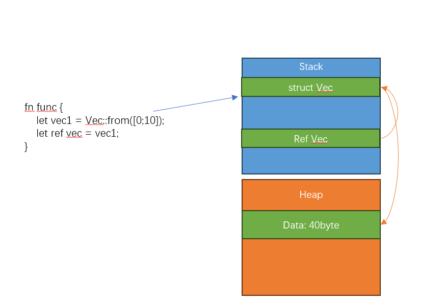

# 借用&引用

上一节我们已经见识过了 所有权的威力，也看到了所有权所带来的编写代码的不方便；那有没有什么方法可以缓解这个痛苦？

借用就是为了 规避(这里并不严谨)所有权规则的限制 而诞生的，借用可以达到的作用就是 可以不需要获得所有权，但是也可以拿到变量 


### 引用
引用一般有两种形式 

 - 共享引用
 - 可变引用

但无论哪种引用 本身是一个 RUST实现的指针类型




```
fn main(){
    let mut vec = Vec::from([0;10]);
    let ref vec_ref = vec;
    println!("{:?}",vec_ref);
    vec.push(1);
    let  vec_ref = &vec;
    println!("{:?}",vec_ref);
    println!("{:?}",vec);
}
```

引用的约束: 

 - 使用引用变量区间，不允许超过被引用的变量的时间 (回答为什么)


### 共享引用
引用默认是共享引用 共享引用的含义就是: 

 - 该引用不拥有该变量的所有权
 - 不能通过引用修改引用的变量
 - 共享引用可以有多份副本 
 

实验1: 共享引用不拥有所有权，共享引用销毁 引用的变量不销毁 

```
#[derive(Debug)]
struct Apple;

fn borrow_apple(apple: &Apple) {
	println!("borrow can access variable{:?}", *apple);
}

fn main() {
	let apple:Apple = Apple;
	borrow_apple(&apple);
	println!(" apple is alive {:?}",apple);
}
```

实验2: 共享引用不能修改引用的变量

```
#[derive(Debug)]
struct Apple{
	size: i32,
}

fn borrow_apple(apple: &Apple) {
	println!("borrow can access variable{:?}", *apple);
	apple.size=20; 
}

fn main() {
	let apple:Apple = Apple {size:10};
	borrow_apple(&apple);
	println!(" apple is alive {:?}",apple);
}
```

实验3: 共享引用实现了Copy 特征，可以被复制多份

```
#[derive(Debug)]
struct Apple;

fn borrow_apple(apple: &Apple) {
	println!("borrow can access variable{:?}", *apple);
}

fn main() {
	let apple:Apple = Apple;
	let apple_ref1 = &apple;
	let apple_ref2 = apple_ref1;

	borrow_apple(&apple_ref2);
	borrow_apple(&apple_ref1);

	println!(" apple is alive {:?}",apple);
}
```

### 共享引用的约束

基于共享引用的特点，RUST 对共享引用也提出了约束 

 - 使用共享引用变量期间，被引用的变量不允许修改 (回答为什么)
 - 使用共享引用期间，不允许有 可变引用再使用 (讲完下一节再看)


实验1: 使用共享引用变量期间，被引用的变量不允许修改 
```
#[derive(Debug)]
struct Apple{
	size: i32,
}

fn borrow_apple(apple: &Apple) {
	println!("borrow can access variable{:?}", *apple);
}

fn main() {
	let mut apple:Apple = Apple {size:10};
	let apple_ref = &apple;
	borrow_apple(&apple_ref);
	apple.size=20;
	
	//let apple_ref = &apple;
	borrow_apple(&apple_ref);

	println!(" apple is alive {:?}",apple);
}
```

### 可变(独占)引用

其实引用有点类似于一个读写锁的实现。读锁可以被很多人使用(读锁占用以后，写锁也被锁)，
写锁只允许一个人持有(持有写锁以后，读锁也被锁)

如果说共享引用隐含读锁的含义，那么独占(可变)引用则隐含有写锁的含义 

可变引用的含义就是: 

 - 该引用不拥有该变量的所有权
 - 可以通过引用修改引用的变量
 - 独占引用不能有多个副本
 
可变引用的约束就是: 

 - 再可变引用生效期间，不允许其他人再修改变量 
 - 一个变量可以有可变引用，该变量也必须是可变的 (思考为什么)
 

实验1: 独占引用不拥有所有权，引用销毁 引用的变量不销毁 

```
#[derive(Debug)]
struct Apple;

fn borrow_apple(apple: &mut Apple) {
	println!("borrow can access variable{:?}", *apple);
}

fn main() {
	let mut apple:Apple = Apple;
	borrow_apple(&mut apple);
	println!(" apple is alive {:?}",apple);
}
```

实验2: 可以通过独占引用修改引用的变量

```
#[derive(Debug)]
struct Apple{
	size: i32,
}

fn borrow_apple(apple: &mut Apple) {
	apple.size=20; 
	println!("mut borrow can modify variable{:?}", apple);
}

fn main() {
	let mut apple:Apple = Apple {size:10};
	println!(" apple original is  {:?}",apple);
	borrow_apple(&mut apple);
	println!(" apple is modified {:?}",apple);
}
```

实验3: 独占引用没有实现Copy特征，`=` 会触发 引用变量所有权移动 

```
#[derive(Debug)]
struct Apple;

fn borrow_apple(apple: &Apple) {
	println!("borrow can access variable{:?}", *apple);
}

fn main() {
	let mut apple:Apple = Apple;
	let apple_ref1: &mut Apple = &mut apple;
	let apple_ref2 = apple_ref1;

	borrow_apple(&apple_ref2);
	borrow_apple(&apple_ref1);

	println!(" apple is alive {:?}",apple);
}
```

实验4: 使用独占引用变量期间，变量不允许修改


```
#[derive(Debug)]
struct Apple{
	size: i32,
}

fn borrow_apple(apple: &mut Apple) {
	apple.size=20; 
	println!("mut borrow can modify variable{:?}", apple);
}

fn main() {
	let mut apple:Apple = Apple {size:10};
	println!(" apple original is  {:?}",apple);
	let apple_ref = &mut apple;
	apple.size = 30;
	borrow_apple(apple_ref);
	println!(" apple is modified {:?}",apple);
}
```

###引用的应用
引用再RUST 中无处不再，需要结合所有权一起理解  下面是一个方法中的引用使用 

```
enum AppleColor {
	Red,
	Green,
}

#[derive(Debug)]
struct Apple{
	size: i32,
	color:AppleColor,
}

impl Apple {
	fn replace_apple(self) -> Apple {
		if (self.size < 20) {
			Apple{size: 20, color:self.color}
		} else {
			self
		}
	}
	
	fn show_apple(&self) {
		println!("{:?}",self);
	}
	
	fn change_color(&mut self, color: AppleColor ) {
		self.color = color;
	}
}

fn main() {
	let mut apple:Apple = Apple {size:10};
	println!(" apple original is  {:?}",apple);
	let apple_ref = &mut apple;
	apple.size = 30;
	borrow_apple(apple_ref);
	println!(" apple is modified {:?}",apple);
}
```


### 总结

所有权规定了一个变量和变量的值该什么时候销毁， 可变变量规定了一个变量是否可变；

所有权实际操作中 会让编码变得困难，引用的出现，再保证变量所有权合法访问基础上 解放了部分变量的访问 


