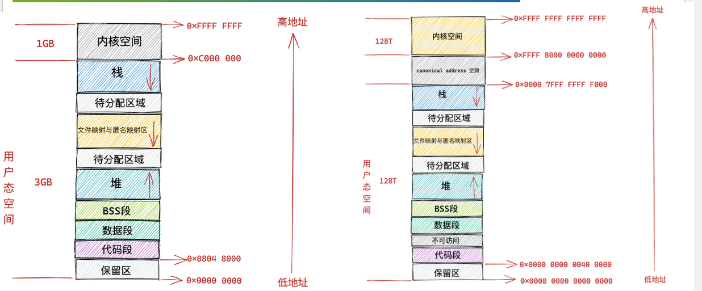
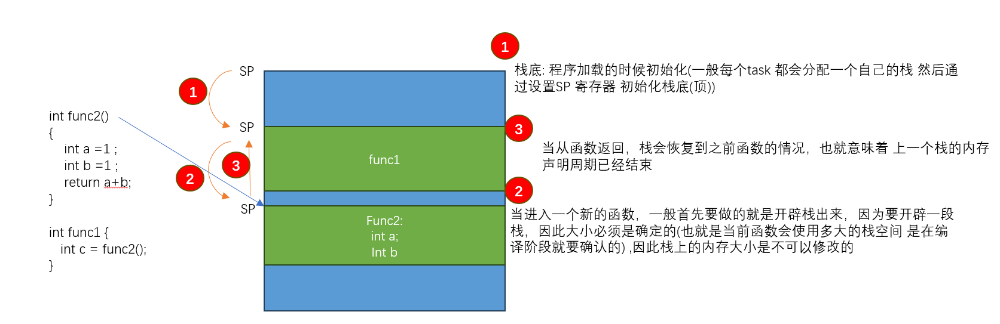
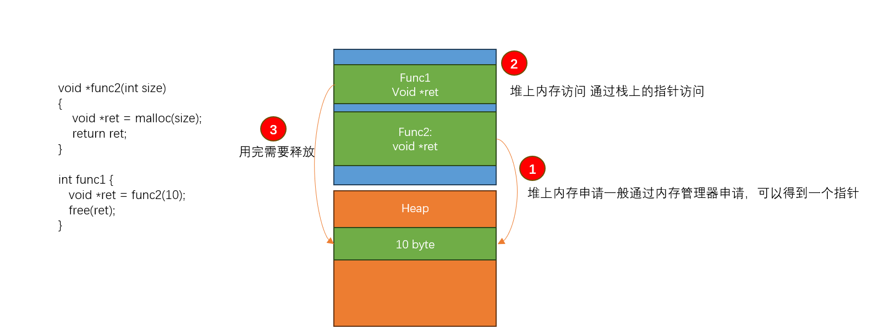

# 前置基础

考虑到每个人基础可能会不一样， 在继续了解RUST关于内存安全的之前，我们需要先讲一些可能会用到的基础

### 内存分区&管理

这部分内容在讲linux 内核内存管理的时候 已经重复过很多次了 如果听过该课的人，对这个应该不陌生了  

这里我们还是使用之前用过的一张图(一个在固定虚拟地址范围内，**用户态**程序的布局图) 

所谓的内存分区，只是对于内存使用的约定成俗的一种规定

在本节课上，我们关注的有: 

栈内存区: 需要先知道常见的汇编规范(ARM64/X86) 一般都会有一个 栈寄存器(指针)，函数的局部临时变量/返回值/等一些函数调用过程中临时
用到的信息 一般都会存储在栈里，栈是一个随程序执行 栈顶不断变化的区域，栈的使用是在编译阶段就确定下来的，这就要求栈的内存大小必须
是固定的 

  - 内存大小是静态的
  - 生命周期是临时的，编译器(汇编) 会自动管理栈的进入和退出动作，程序员不需要关心 
   

堆内存区: 当程序需要使用到动态大小内存，必须要用到堆上的内存，访问堆上的内存则需要通过栈上(全局)的指针访问 

  - 内存大小是动态分配的 
  - C语言中 生命周期由程序员自管理
  

数据区: 用来存放全局变量 静态局部变量 这类生命周期为全局的  

  - 内存大小是静态的 
  - 生命周期随程序的生命周期相同(等同于永久 程序不灭 内存不灭)
  

总结一下: 
  
  - 栈的大小是固定的，生命周期 编译器负责，等同于 程序员不需要关注栈内存的管理(但是可能使用不当: 越界、爆栈) 
  - 堆上的内存，大小以及生命周期都是程序员自己负责(C语言中), 如果管理不当，可能 内存泄漏、UAF 、 double free、越界等
  - 数据区大小是固定的，生命周期是永久的， 等同于 程序员不需要关注内存的管理(但是可能使用不当: 越界)

### 内存管理技术

手动管理:C语言管理堆上内存，需要程序员自己写代码管理，常用的手段有: 通过封装资源申请(alloc/release)，引用计数(get/put)接口 防止出现
          UAF问题，但是程序是否正确使用了接口，也需要程序自己保证代码正确性  

自动管理: 现在有很多高级语言，比如java lisp 实现了GC(内存自动回收)，等于接管了 堆上内存的管理，程序员不需要在付出大量精力管理
堆上的内存(代价是GC的运行也需要占用系统资源，而且会阻塞程序执行)

半自动: 由于性能原因， 放弃了GC这种动态机制，而是在底层实现了一些专门的类型 比如智能指针，减少程序员对指针的管理，实现内存自管理

### 内存分配

前面已经讲过了，栈上的内存以及数据区的内存，分配管理是静态实现的，重点讲一下堆上的内存 

 - 用户态程序一般习惯使用 libc 提供的内存管理器(malloc free 小块内存分配) 或者使用 memmap 分配内存(页分配) 
 - 内核态有自己的内存分配器: kmalloc/vmalloc/page_alloc 等 
 
 
### 内存管理缺陷和安全

前面已经说了，C语言首先需要自己管理堆上内存的分配释放，其次对于内存访问是不受约束的(指针类型转换是很常见的) 

在说一下内存安全，内存安全的几个原则 

 - 程序不应该访问它不应该访问的内存 
 - 不应该出现和使用 无效的内存 
 - 代码中使用的变量或者内存，在任何时候都应该是有效的
 - 访问和使用内存不应该出现不符合预期的情况(并发修改、越界访问是一个例子)
 
 关于更多安全内存的问题 我们在本系列课程一开始也已经介绍过了 简单回顾一下即可 
 
 
 
### RUST内存安全三原则

RUST 通过规范内存的三个原则，用以解决上述问题，分别是: 

 - 所有权
 - 生命周期
 - 借用和移动

我们下面将对这些内容进行展开 
