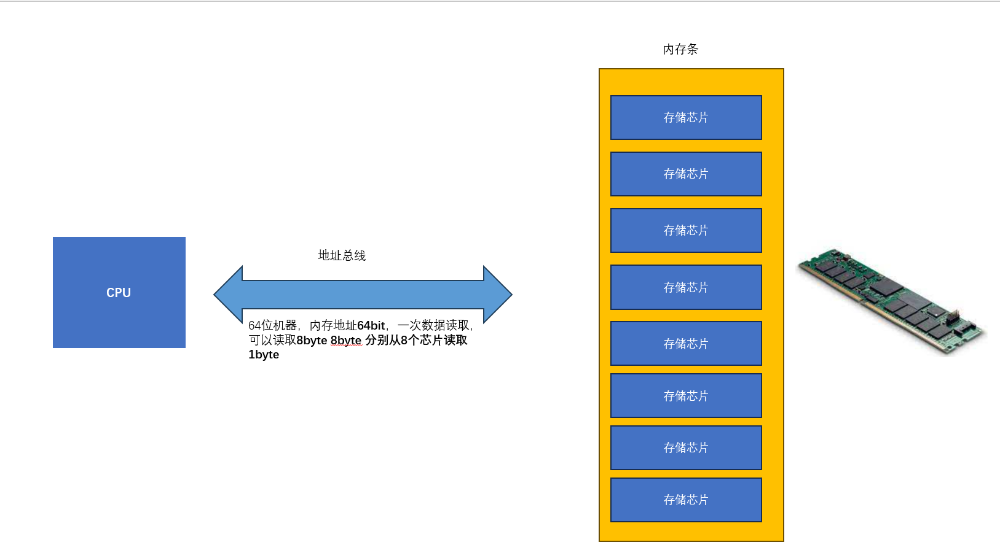

# 内存其他知识点


### std:mem 模块

标准库中的mem模块 为我们提供了获取内存大小的接口

 - size_of 返回通过泛型获得的类型大小
 - size_of_val 返回某个引用值的大小
 
```
struct Layout<T,U,V> {
	a: T,
	b: U,
	c: V,
}

type Layout_i32 = Layout<i32,i32,i32>;

fn main() {
	println!("Layout<i32,i32,i32> size is : {}",std::mem::size_of::<Layout_i32>());
}

```


### 内存对齐

先说一下内存对齐的背景；

 


上图是CPU 访问内存的原理图，我们知道内存地址的基础单位是 Byte `0x01` `0x02` 两个地址代表他俩间隔1byte

```

struct Data {
	a: i32, // 4byte
	b: u16, // 2byte 
	c: u8,  // 1 byte
	d: u16, // 2 byte
}
//假设上述结构体被放在了 0x1000 的内存地址，现在需要访问 结构体中的a b c d元素 会发生什么情况 

fn main() {
	let data = Data {a:0,b:0,c:0,d:0};
	let d = data.d; //如果内存布局时平铺的 data.d的内存地址是? 
}

```


结论：内存对齐的本质诉求是希望在访问一个元素，不希望需要多次 读取内存，减少性能损失 

弊端：为了内存对齐，必然会浪费内存，因此C语言经常需要程序员考虑结构体字段顺序，从而能够获得最小的内存浪费 

RUST改进: RUST 会自动调整结构体字段顺序，让内存浪费降到最低

```
use std::mem;

#[repr(C)]
struct FieldStruct {
    first: u8,
    second: u16,
    third: u8
}

struct FieldStruct2 {
    first: u8,
    second: u16,
    third: u8
}

fn main() {
    assert_eq!(6, mem::size_of::<FieldStruct>());
    assert_eq!(6, mem::size_of::<FieldStruct2>());
}

```

 - #[repr(C)] 可以让内存布局按照C的布局方式，一般在和C进行接口交互时使用
