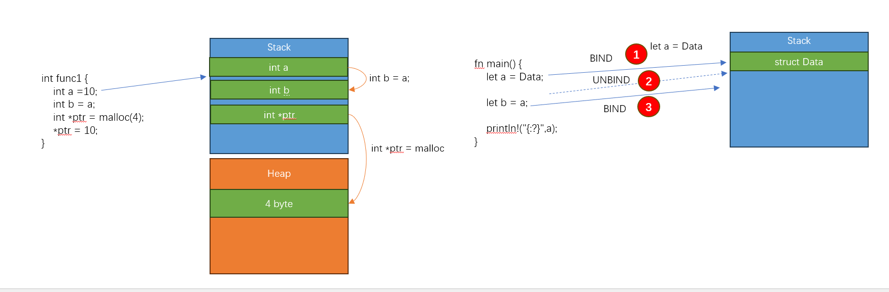
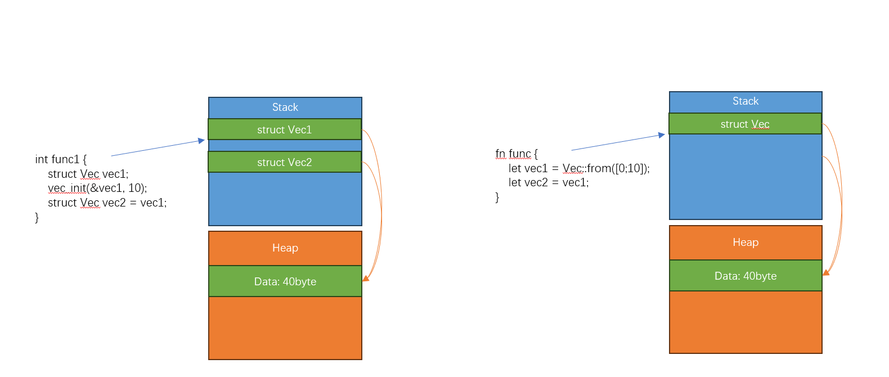

# 所有权

以下内容我会不断在这个章节的每个小节重复 

内存管理的问题: 
 
 - C语言需要程序自己管理(合理申请和释放)堆内存;管理不好后果比较严重 

内存安全的问题:  
 
 - 程序不应该访问它不应该访问的内存 
 - 不应该出现和使用 无效的内存(已经释放的内存) 
 - 代码中使用的变量或者内存，在任何时候都应该是有效的
 - 访问和使用内存不应该出现不符合预期的情况

### 何为变量？
无论访问堆或者是栈上的内存，我们之前已经讲过，都必须要通过变量访问 

变量经过编译器解释，代表的就是栈上的指针，实际生成的汇编没有变量这个概念，而是通过 `sp -4; sp -8` 这种栈指针偏移访问 

所以: 变量的类型必须是 内存大小明确的 


###在所有权之前
让我们回顾内存管理的一个问题，谁应该释放指针？

在C里面，指针是可以非常容易的传递给其他人的

```
void func2(void **ptr) {
	free(ptr2);
	//原始指针被写为NULL 是C里面一种编程习惯，防止释放的指针被继续使用
	*ptr = NULL;
}

void func() 
{
	void *ptr1 = malloc(10);
	void *ptr2 = ptr1;
	func2(&ptr2); 
	//虽然ptr2已经是NULL了，但是ptr1的指针依然还有值，但是这个时候已经 悬空了 
}
```

我们看一下上面的问题，核心在于指向 堆上一个内存区域的指针，可以被轻易的复制，也可以轻易的传递；最后结果往往就是
指向一个内存的地址，会在程序的任何地方都可以出现被使用

所有权的一个核心思想就是，能不能让一个内存，只有一个所有者？只有该所有者变量(访问内存 都需要经过变量) 有该内存的所有权


Rust 强制实行 RAII（Resource Acquisition Is Initialization，资源获取即初始化），
所以任何对象在离开作用域时，它的析构函数（destructor）就被调用，然后它占有的资源就被释放

###所有权转移

所有权转移是为了 践行 所有权第一原则: 一个内存在一个时刻只能有一个所有者，如果该 所有者变量被赋值给了其他变量，则原有的变量 
不在拥有该内存所有权，所有权发生了转移，转移给被赋值的新的变量

理解为什么会报错
```
#[derive(Debug)]
struct Data;

fn main() {
	let a = Data;
	let b = a;
	
	println!("{:?}",a);
}
```


###转移和复制
上一个小节 我们已经讲了 关于所有权转移 再看一个示例 

```
fn main() {
	let a = 10_i32;
	let b = a;
	println!("{:?}",a);
}
```

？怎么不报错了呢？这涉及到另外一个问题，叫做复制 

这就需要 讲清楚  `a=b` 把一个变量赋值给另外一个变量 到底是什么意思 

在C语言里面，`a=b`的含义是 把变量b的内存(栈) 逐字节copy给变量a 让我们看一个图

下图展示了上一节的绑定转移过程，也展示了传统的C的复制过程；我们必须要知道两者的区别

**RUST 对于变量的行为 默认是采用的 绑定解绑的转移过程**



但是为什么在我们这个例子里就又不行了呢？ 原因在于 RUST 在 采用转移之前，会先查看变量是否实现了 一个叫做 Copy的特征，如果
实现了copy的特征，则会调用对象的copy函数 

```
 let a  = b; // if b has Copy trait, will call let a = b.clone()
```

所以 上面之所以没有报错 是因为 i32类型实现了Copy特征 其行为类似于C 里面的复制，会新生成一个栈上的空间 执行按位copy 

```
#[derive(Debug,Copy,Clone)]
struct Data;

fn main() {
	let a = Data;
	let b = a;
	
	println!("{:?}",a);
}
```

###Copy和Clone

通过阅读标准库，可以知道 Copy 是一个marker 特征(空的标记特征)，仅仅用来告诉编译器 是否需要替换掉 赋值表达式 而使用clone 

```
pub trait Copy: Clone {
    // Empty.
}
```

因此 想要实现 Copy的类型，必须要实现Clone特征

类型可以只实现clone，但是选择不实现Copy特征,如果是这样，类型必须自己明确调用clone，表明要实现 一个复制动作 


###简单介绍一下Vec

为了加深关于复制的语义，我们在之前有必要 先介绍一下Vec类型； 

我们目前为止还没有见到过指针，也没有为 任何一个类型尝试去从堆上申请内存 

第一个点: 使用堆上的内存 本身和类型是无关的 

```
int main() {
	int a = 10; //a 是栈上分配的内存 
	int *ptr = malloc(sizeof(int)); ptr指向的是一个大小为int 类型的堆内存 
}
```

第二个点: 内存大小可变的类型，习惯从堆上分配内存 

使用C实现的一个 动态数组示例 
```
struct Vec {
	int len;
	int *data;
	int capacity;
}

void init( struct Vec *vec,int capacity) {
	vec->data = malloc(sizeof(int) *capacity);
	vec.len = 0;
}


void push( struct Vec *vec,int val) {
	if (len <capacity) {
		data[len] = val;
		len++;
		return;
	}
}
```

利用std 封装好的 动态数组示例

```
fn main() {
	let arr: [i32;3] = [1,2,3]; //数组内存大小不可变 是从堆上分配的 
	let mut vec: Vec<i32> = Vec::from(arr); // 动态数组，数据放在堆上
	vec.push(4);
	println!("{:?}",vec);
}
```

### 移动?Copy?Clone?

假设在RUST 中 动态数组类型 实现了copy的特征 会是什么情况？ **会导致堆上所有权被破环**



```
fn main() {
	let arr: [i32;3] = [1,2,3]; //数组内存大小不可变 是从堆上分配的 
	let mut vec: Vec<i32> = Vec::from(arr); // 动态数组，数据放在堆上
	vec.push(4);
	let vec2 = vec;
	println!("{:?}",vec);
}
```

总结: 

 - RUST对于新创建的类型， 默认不会实现Clone/Copy 特征，因此都是所有权移动 
 - RUST提供的基元类型，因为都是栈上分配内存，所以都实现了 Clone/Copy 特征，因此赋值和C行为类似，编译器会在编译阶段就为新的变量预留栈内存
 - RUST提供的高级类型(使用到了指针和堆内存，String,动态数组) 实现了Clone特征，没有实现Copy，赋值是所有权移动，但是可以通过显示调用
   Clone，实现堆上内存的copy
 - 我们自己在实现类型，要根据实际情况，判断是否需要提供Clone 特征，也要根据实际情况(是否会涉及堆内存，以及堆内存是如何管理的) 决定是否需要
   提供Copy的语义
 - 类型是否需要提供Copy 一定要在设计阶段就要想清楚，如果后面修改，对使用者会造成极大破坏(思考为什么？)

思考: 复制 是否会破环 所有权 原则(一个内存 在同一时间 只能拥有一个所有者)？ 


### 变量销毁 

在RUST中，值和变量 会在拥有所有权的变量作用域消失时 一起销毁 


### 所有权转移的应用
所有权转移贯穿RUST的代码(哪里都需要使用变量)；每次遇到错误，要能根据编译器提示 知道发生了什么


实验: 函数调用会发生转移
```
#[derive(Debug)]
struct Apple;

fn move_apple(_apple: Apple) {
}

fn main(){
	let apple = Apple;
	move_apple(apple);
	println!("{:?}",apple);
}
```

实验: 获取数组元素 会发生转移,不允许破环数组的完整性 

```
#[derive(Debug)]
struct Apple;

fn main(){
	let apple_arr: [Apple;3]= [Apple,Apple,Apple];
	let apple0 = apple_arr[0];
}
```

实验: 获取结构体元素 会发生转移,被破坏的结构体无法再使用

```
#[derive(Debug)]
struct People;

#[derive(Debug)]
struct Station {
	peoples: Vec<People>,
}

fn main(){
	let mut beijingxi: Station= Station {
		peoples: Vec::new(),
	};
	
	let mut peopleVec = beijingxi.peoples;
	
	peopleVec.push(People);
	
	println!("{:?}",peopleVec);
	println!("{:?}",beijingxi);
}
```

实验: 版本2

```
#[derive(Debug)]
struct People;

#[derive(Debug)]
struct Station {
	peoples: Vec<People>,
}

impl Station {
    fn addOnePeople(mut self) -> Self{
        self.peoples.push(People);
        self
    }
}

fn main(){
	let mut beijingxi: Station= Station {
		peoples: Vec::new(),
	};
	
	beijingxi = beijingxi.addOnePeople();
	
	println!("{:?}",beijingxi);
}
```

从上面代码，我们看到了，所有权的严苛，造成编写代码会很困难，下一节我们学习过借用之后，会缓解这种痛苦
 


