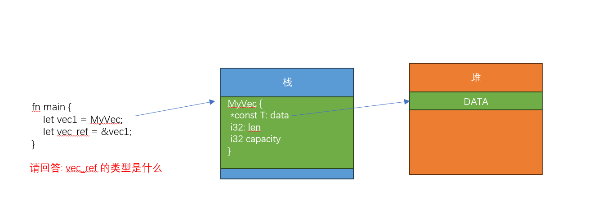

# 指针

讲内存安全，如果不讲指针，那一定是缺失的

之前我们其实已经见到过指针了(引用就是一种`安全的指针`) 内存安全这一章节 我们一开始也讲过了 栈和堆的概念 

虽然大多数情况，指针几乎都用来指向堆上的内存，但是指针含义本身不区分堆和栈 

```
struct Apple(i32);

fn main() {

	let a:i32 = 10; // 10这个值 默认是在栈上的 
	let a_ref = &a; // a_ref 引用 指向的内存是栈上的内存 
	
	let apple: Apple = Apple(100); // RUST 对于基础类型，默认内存分配都是在栈上分配的 所以APPLE 的内存也是在栈上的 
	let a_ref = &apple; // a_ref 引用 指向的内存是栈上的内存 
}

```


正常来说，堆上的内存 必须要使用 `堆内存分配器`  才能够申请内存 比如libc的 malloc，或者是Linux内核中的 kmalloc，Vec类型实际上
封装了内存申请的动作，我们将在后面看到更多相关内容 


### 引用
在借用章节，我们已经介绍过了引用，引用是RUST中，为了实现借用语义，封装的 指针类型，让我们在回顾一下: 

 - 引用永远不会为空值
 - 引用指向的内存总是有效的 
 - 引用访问内存，不会出现多人修改的问题

引用指向的内存，可以是栈上的内存，我们目前使用到的引用都是指向栈上的，但是也可以指向堆上的内存（依赖智能指针的Deref特征）

在后面讲解智能指针，我们会针对

```
struct Apple {
	size: i32,
}

fn main() {
	let a = 10;
	let a_ref = &a;
	
	assert_eq!(10, *a_ref);
	//assert_eq!(10, a_ref);

	println!("{:p}", a_ref);
	
	let apple = Apple{size:100};
	
	let a_ref = &apple;
	
	assert_eq!(100, (*a_ref).size);
	
	assert_eq!(100, a_ref.size);//这里发生了什么？？？？？
}
```

### 理解指针和解引用 

```
int main(){
	int a = &10;
	int *ptr_a = &a;
	
	*ptr_a =100；    // 这里发生了什么？？
	int b = *ptr_a; //这里发生了什么 ？？ RUST 行为应该是什么
}

```


### 原始指针

RUST中通常一般不会直接使用原始指针 一般只会在和其他语言(C/C++) 交互时，又或者在某些需要提高性能的场景 需要使用(需要unsafe 标记)

但是无论如何，原始指针确实是RUST最基本的指针类型  

RUST 有两种原始指针类型: 熟悉C语言的 对这里的 \* 应该不会陌生 
 
 - *const T (像不像 C 里面的 const T *)
 - *mut T


这个示例我们演示了 常量指针的操作方法，可以看到，基本上和C里面的使用方法一样 

```
fn main() {
	let mut a = [1,2,3];	
	let a_ptr = &a as *const [i32;3];
	
	println!("{:p}", a_ptr);
	
	println!("{:p}", a_ptr.wrapping_add(1));
	
	let a_ptr = &mut a as *mut i32;

	println!("{:p}", a_ptr);
	println!("{:p}", a_ptr.wrapping_add(1));
	
	unsafe {
	    *a_ptr.wrapping_add(1) += 10;
	}
	println!("{:?}", a);
}
```

safe和unsafe: RUST 被称为安全的，是因为支持了很多安全相关的约束(已经学习过的所有权、引用约束)，但是有些时候，我们的代码出于某种原因，无法
遵守这些约束，因此RUST 中，还提供了unsafe 模式，在该模式下，RUST 会减少安全检查


请给出下面输出的答案

```
fn unvalid_ptr() -> *const i32 {
    let mut a = [1,2,3];	
	let a_ptr = &a as *const i32;
	unsafe {
		println!("unvalid_ptr {:?}", *a_ptr);
	}
    println!("unvalid_ptr {:p}", a_ptr);	
    a_ptr
}

fn main() {
	let a_ptr = unvalid_ptr();
	println!("main {:p}", a_ptr);
	unsafe {
		println!("main: {:?}", *a_ptr);
	}
}
```

引用可以转为原始指针
```
#[derive(Debug)]
struct Apple(i32);

fn main() {
	let mut apple_vec = Vec::from([Apple(1),Apple(2),Apple(3)]);
	
	let apple2_ptr = apple_vec.get_mut(2).unwrap() as *mut Apple; 
	
	unsafe {
	    (*apple2_ptr).0 = 10;
	}
	println!("{:?}",apple_vec);
}
```

使用原始指针 引用的生命周期保护不再生效 所有权依然生效
```
#[derive(Debug)]
struct Apple(i32);

fn main() {
    let mut a = Apple(10);
    let a_ptr  = &a as *const Apple;
    let a_ptr2  = &mut a as *mut Apple;
    
    unsafe {
        (*a_ptr2).0 = 100;
        println!("a_ptr is {:?}",*a_ptr);
        
        let b = *a_ptr; // cannot move out of `*a_ptr` which is behind a raw pointer
    }
}
```

### Drop特征

目前， 我们目前使用的示例 使用的 变量内存都是 栈上分配的内存，

我们再本章节一开始已经阐述过: 栈上的变量和 内存生命周期都是编译阶段 硬编码完成的；

我们也已经了解过了所有权的概念，一块地(内存) 必须要有一个地主，也只能有一个地主，地主其实就是变量，当地主passwd away之后，这块地也必须销毁，
否则就会成为无主之地；

由于地主一定是一个变量，除了静态全局变量，地主的生命周期 也是栈自动管理的； 

那如果指针指向的是一个堆上的内存，就又不得不提到我们之前讲的内存安全问题: 

  - 堆上的内存生命周期再C语言中是程序员手动管理的
  - 应该再什么时机去销毁这个内存？ 会不会出现有人销毁内存之后，还会有人继续访问？
  - 会不会出现 double free？
  - 会不会出现悬空指针 

上述问题RUST 都是通过智能指针解决的，但是再讲智能指针之前，需要先讲智能指针依赖的基础机制

这就引入了本节的内容: Drop特征, Drop特征为 智能指针提供释放内存的方法实现，当资源超出作用域后，会自动调用drop
方法释放资源，类似于C++里面的析构

```
pub trait Drop {
    // Required method
    fn drop(&mut self);
}
```

如果一个类型，实现了drop特征，RUST编译器会在拥有所有权的变量作用域消失的时候，调用该方法

这个示例模拟了一个 Vec 的类型，虽然他没有真的申请内存，但是证明了Drop方法的调用
```
struct MyVec<T> {
	ptr: *const T,
	len: i32,
    capacity: i32,
}

impl<T> Drop for MyVec<T> {
	fn drop(&mut self) {
		println!("assume we call free function to free pointer");
	}
}

fn main() {
	let data:i32 = 10;
	let _myvec = MyVec {
		ptr: &data, len:1, capacity:1, 
	};
}
```


### Deref 

Drop特征还是很好理解的，Deref 稍微可能有点绕一些，我们尽量使用简单的示例说明他 




Deref 是实现智能指针的基础，智能指针有两层含义 

 - 是指针的变体，在使用智能指针的时候 我们希望像使用一个普通指针一样 
 - 是原始指针的封装，是一个新的类型

下面简单演示了 deref的使用场景，根本目的是 为了使用智能指针像使用一个普通指针一样可以解引用 
```
use std::ops::Deref;

// 定义一个自定义的智能指针类型 `MyBox`
struct MyBox<T>(T);

impl<T> MyBox<T> {
    // 创建一个新的 MyBox，将给定的值分配到堆上，并返回 MyBox 指针
    fn new(x: T) -> MyBox<T> {
        MyBox(x)
    }
}

// 实现 Deref trait，以支持解引用操作
impl<T> Deref for MyBox<T> {
    type Target = T;

    // 返回指向 MyBox 中数据的引用
    fn deref(&self) -> &Self::Target {
        &self.0
    }
}

fn main() {
    // 创建一个 MyBox 指针来存储堆上的数据
    let my_box = MyBox::new(5);

    // 使用解引用操作符 * 来获取指针所指向的值
    println!("Value: {}", *my_box);
}

```

当我们对智能指针 Box 进行解引用时，实际上 Rust 为我们调用了以下方法：`*(y.deref())`

首先调用 deref 方法返回值的常规引用，然后通过 \* 对常规引用进行解引用，最终获取到目标值。

至于 Rust 为何要使用这个有点啰嗦的方式实现，原因在于所有权系统的存在。
如果 deref 方法直接返回一个值，而不是引用，那么该值的所有权将被转移给调用者，
而我们不希望调用者仅仅只是 \*T 一下，就拿走了智能指针中包含的值。 (思考)


### deref 自动转换

如果deref 可以对一个结构体获得另外一个类型的引用，那么如何获得原有类型的引用呢？

```
use std::ops::{Deref, DerefMut};

#[derive(Debug)]
struct MyBox<T>{
    data:T,
    len:u32,
}

impl<T> MyBox<T> {
    fn new(x: T) -> MyBox<T> {
        MyBox{data:x, len:0}
    }
}

impl<T> Deref for MyBox<T> {
    type Target = T;
    // 返回指向 MyBox 中数据的引用
    fn deref(&self) -> &Self::Target {
        &self.data
    }
}
impl<T> DerefMut for MyBox<T> {
    // 返回指向 MyBox 中数据的引用
    fn deref_mut(&mut self) -> &mut Self::Target {
        &mut self.data
    }
}

fn show_data(data: &i32) {
    println!("{}",data);
}

fn main() {
    let mut my_box = MyBox::new(5_i32);
	let my_ref = &mut my_box; //这里的 my_ref 类型究竟是  &MyBox 还是 &i32???
	my_ref.len = 10_u32; // 引用默认还是自己 &mybox 
	
	*my_box = 100_i32; // 如果右边类型是i32 则左边会自动匹配
	show_data(&my_box); //如果使用了类型的引用类型，会根据目标类型，决定是否调用deref 替换 
	println!("{:?}",my_box);
}
```

###连续的deref 转换 

```
use std::ops::Deref;

struct BoxData<T>(T);

impl<T> BoxData<T> {
    fn new(x: T) -> BoxData<T> {
        BoxData(x)
    }
}

impl<T> Deref for BoxData<T> {
    type Target = T;
    // 返回指向 BoxData 中数据的引用
    fn deref(&self) -> &Self::Target {
        &self.0
    }
}

struct MyBox<T>(T);

impl<T> MyBox<T> {
    fn new(x: T) -> MyBox<T> {
        MyBox(x)
    }
}

impl<T> Deref for MyBox<T> {
    type Target = T;
	// 返回指向 MyBox 中数据的引用
    fn deref(&self) -> &Self::Target {
        &self.0
    }
}

fn print_box(data: &i32){
	println!("{}", data);
}

fn print_mybox<T:std::fmt::Display>(data: &BoxData<T>){
	println!("{}", data.0);
}

fn print_mybox2<T>(data: &BoxData<T>){
	//能不能再通过 &BoxData 自动转为 &i32????  
	print_box(data);

}

fn main() {
    let my_box = MyBox::new(BoxData::new(5));
	
	//根据 print_mybox 参数，发生了引用类型转换 &MyBox -> &BoxData 
	print_mybox(&my_box);
	
	//根据 print_box 参数，发生了引用类型转换 &MyBox -> &BoxData -> &i32 
	print_box(&my_box);

    print_mybox2(&my_box);
}
```

注意: Deref 隐含有 当通过 \* 访问内容时，一定时透过 引用去访问的，不允许所有权转移 


###引用归一化

在这段源码中，&T 被自动解引用为 T，也就是 &T: Deref<Target=T> 。 
按照这个代码，&&&&T 会被自动解引用为 &&&T，然后再自动解引用为 &&T，以此类推， 
直到最终变成 &T。

```
impl<T: ?Sized> Deref for &T {
    type Target = T;

    fn deref(&self) -> &T {
        *self
    }
}
```

当我们对一个变量嵌套多层引用，不需要手动经过层层解引用去访问它(想象一下C语言中的多级指针解引用)

### 三种deref转换 

 - 当 T: Deref<Target=U>，可以将 &T 转换成 &U，也就是我们之前看到的例子
 - 当 T: DerefMut<Target=U>，可以将 &mut T 转换成 &mut U
 - 当 T: Deref<Target=U>，可以将 &mut T 转换成 &U
 
不再多讲