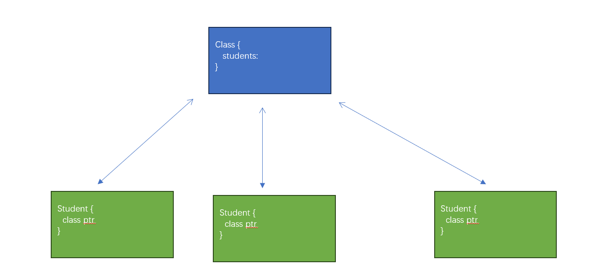
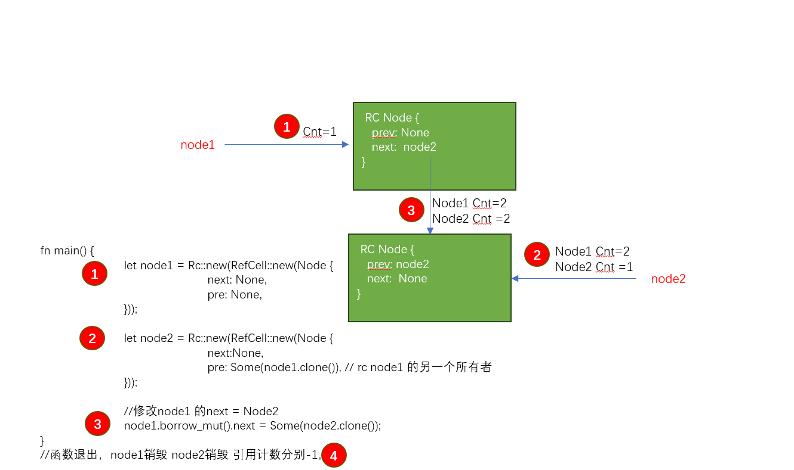

# 引用计数指针

上一个章节，我们已经简单见识到了 Box 的威力 

 - 遵循RUST所有权、引用 基本机制
 - 可以通过所有权 和 drop 自动管理堆上内存的生命周期管理 
 - 使用box 就像使用普通指针一样方便 
 
但是编程的世界，情况有时都会很复杂，Box相比较我们学习过的其他类型，除了内部数据的内存是从堆上分配，
还有需要通过 解引用使用内部数据之外，几乎没有区别；

你还记得我们之前提出的一个问题，班级和学生的关系

这也是C里面经常会遇到的情况，一个结构体包含另外一个结构体，但是另外一个结构体，也需要保存指向包含结构体的 
对象指针

让我们看看Box能不能完成这项工作 

```
#[derive(Debug)]
struct Student<'a> {
    name: String,
    class_ref: &'a Class<'a>,
}

#[derive(Debug)]
struct Class<'a> {
    id: i32,
    students: Vec<Student<'a>>,
}

impl<'a> Class<'a> {
    fn add_student(&'a mut self, name: &str) {
        let students_ref = &mut self.students;
        let nwe_stu = Student {
            name: String::from(name),
            class_ref: self,
        };
        students_ref.push(nwe_stu);
    }
}

fn main() {
    let mut class1 = Class {
        id: 1,
        students: Vec::new(),
    };
    
    class1.add_student("Jack");
    class1.add_student("Rose");
}
```

由于引用的严格安全性，一旦引用被结构体使用 几乎意味着 该内存不能被任何人修改





### RC<T>简单使用
Rc 是RUST 提供的一个智能指针类型，该指针类型 通过内部引用计数 决定什么时候释放内存 

 - 创建一个Rc指针通过: Rc::new 
 - 引用计数增加 通过 :rc.clone ，该方法不会复制堆上内存，只是复制了指针，但是引用计数增加1 
 - 多个引用计数指针 都拥有该内存的所有权
 - Rc指针不提供 dermut. 意味着不能解引用 修改指针指向的内存的值 
 - 多线程场景不能使用该类型
 - RUST为多线程场景提供了另外一个类型: Arc 

基本使用
```
use std::rc::Rc;

#[derive(Debug)]
struct Apple(i32);

impl Drop for Apple {
    fn drop(&mut self) {
        println!("apple drop");
    }
}
fn main() {
	let ptr1; 
	{
		let ptr2 = Rc::new(Apple(10));
		ptr1 = ptr2.clone();
	}
	println!("{:?}",ptr1);
}
```

RC指针任何时候都无法修改
```
use std::rc::Rc;

#[derive(Debug)]
struct Apple(i32);

impl Drop for Apple {
    fn drop(&mut self) {
        println!("apple drop");
    }
}
fn main() {
	let ptr1 = Rc::new(Apple(10)); 
	let ptr2 = ptr1.clone();

	(*ptr2).0 = 100;
	
	println!("{:?}",ptr1);
}
```

### 内部可变性:Cell

我们已经学习过了 引用、Box Rc 甚至是原始指针，都还是非常简单的智能指针  再回顾一下

 - 引用的使用要求是非常严格的，会在静态编译期间通过 引用生命周期检查 引用是否合法
 - Box只是堆上的一个指针，基本上和引用使用方法一样(支持了 Deref 和 DerefMut)  符合引用约束
 - Rc 允许多个变量拥有 同一个内存的所有权，但是Rc 拥有的变量 变量所有权都是不可变的

到目前为止，这几种都是很好理解的指针，说他们很好理解，是因为他们的安全机制很简单，符合我们对于内存安全的认知

下面，介绍的内容，就可能比较不容易理解 

RUST 允许通过 Cell 类型的不可变引用，修改内部值

Cell的定义:

```
pub struct UnsafeCell<T: ?Sized> {
    value: T,
}

pub struct Cell<T: ?Sized> {
    value: UnsafeCell<T>,
}

```

从定义可以看到，就是一个封装了值的结构体，他最奇特的地方在于 支持不可变引用修改内部值


```
use std::cell::Cell;

fn main() {
	let a =  Cell::new(10);
	a.set(1000);
	println!("{:?}",a);

	let b = &a;

	b.set(100);
	let a1 = a.get();
	
	println!("{}",a1);
}
```

Cell既然允许不可变引用修改内部值，是否违反了内存安全？ Cell自己依然遵循引用的规则

```
use std::cell::Cell;

fn main() {
	let a = Cell::new(10);
	a.set(1000);
	println!("{:?}",a);

	let b = &a;
	let c = &mut a;

	b.set(100);
	let a1 = a.get();
	
	println!("{}",a1);
	
	println!("{}",c);
}
```

Cell 一般用来支持Copy的类型(实现了复制语义的类型) 因为get本质上调用的依然是Copy

```
use std::cell::Cell;

struct Apple(i32);

fn main() {
	let a = Cell::new(Apple(100));
	let b = a.get(1000);
}
```

总结一下: 

 - Cell通过对类型封装，以及原子的set/get 方法，支持不可变引用修改内部值,但是也保证了内存一致性(为什么) 
 - Cell 仅支持内部类型实现了Copy语义的类型(我这里不用栈上的类型，想想为什么)
 
应用场景: 由于Cell仅支持实现了Copy类型的封装，实际开发中使用不多，一般仅再 结构体中 对基础类型进行封装

```
use std::cell::Cell;

#[derive(Debug)]
struct Apple {
	size: Cell<i32>,
	price: Cell<u32>,
}

impl Apple {
	fn change_price(&self, price: u32) {
		self.price.set(price);
	}
}

fn main() {
    let app = Apple{size: Cell::new(10), price: Cell::new(10)};
    
    app.change_price(1000);
    
    println!("{:?}",app)
}
```


### 内部可变性:RefCell
由于Cell仅支持Copy类型，因此一般很少使用，更多情况我们是为了解决下面的问题: 

 - RUST编译器 只允许一个内存只有一个地主(所有权):    RC智能指针 允许一个内存拥有多个地主
 - RUST编译器 只允许拥有一个可变引用或者多个不可变引用: Cell 允许不可变引用修改值 
 
RefCell 允许再运行时，对不可变引用借用可变引用修改内存的值 

```
use std::cell::RefCell;

fn main() {
	//let data = Box::new(10);
	
	//*data = 20; //通过derefmut 得到可变引用修改值，这里不可能实现 
	
    let s = RefCell::new(Box::new(10));
    let mut s1 = s.borrow_mut();
    
    **s1 = 20;

    println!("{}", s1);
}
```

refcell 最常和RC智能指针结合使用；与拿来我们是无法修改Rc包含的内存地址的，但是通过现在通过refCell可以实现
内存修改

```
use std::rc::Rc;
use std::cell::RefCell;

#[derive(Debug)]
struct Apple(i32);

fn main() {
	//let app = Rc::new(Apple(10));
	
	//(*app).0 = 100; //无法修改
	
	let app = Rc::new(RefCell::new(Apple(10)));
	
	let mut app2 = app.borrow_mut();
	
	(*app_mut_ref).0 = 100; 
	
	println!("{:?}",app_mut_ref);
	println!("{:?}",app);
}
```

refcell 虽然允许通过动态借用可变引用 但是也遵循引用的使用安全 只允许可变借用一次

```
    pub fn borrow_mut(&self) -> RefMut<'_, T> {
        match self.try_borrow_mut() {
            Ok(b) => b,
            Err(err) => panic_already_borrowed(err),
        }
    }

```


### 循环引用

利用已有知识，我们尝试写一个双向链表实现，来继续引入这个小节的话题 

```
use std::rc::Rc;
use std::cell::RefCell;


#[derive(Debug)]
struct Node {
	next: Option<Rc<RefCell<Node>>>, // 为什么必须要用rc
	pre: Option<Rc<RefCell<Node>>>,
}

impl Drop for Node  {
	fn drop(&mut self) {
		println!("drop node");
	}
}

fn main() {
	let node1 = Rc::new(RefCell::new(Node {
		next: None, 
		pre: None,
	}));
	
	let node2 = Rc::new(RefCell::new(Node {
		next:None,
		pre: Some(node1.clone()), // rc node1 的另一个所有者
	}));
	
	//修改node1 的next = Node2 
	//let mut _borrowed = node1.borrow_mut();
	node1.borrow_mut().next = Some(node2.clone());

    //_borrowed.next = Some(node2.clone());
}


```




### 弱引用

 - Rc内部维护两个引用计数，一个是强引用计数，一个是弱引用计数
 - RC 会在强引用计数降为0 以后，销毁内存 
 - 经过`clone`得到的实例，都是强引用类型；视为持有该内存的所有权 
 - 经过`downgrade`得到的类型为弱引用类型， 不持有内存所有权，不会增加引用计数，不能阻止内存销毁 
 - 通过弱引用使用内存，必须要先经过`upgrade`方法 转为强引用类型才能使用(可能失败 因为内存可能被释放)
 - 弱引用主要用来解决循环引用的问题  

使用示例: 

```
use std::rc::Rc;
fn main() {
    // 创建Rc，持有一个值5
    let five = Rc::new(5);

    // 通过Rc，创建一个Weak指针
    let weak_five = Rc::downgrade(&five);

    // Weak引用的资源依然存在，取到值5
    let strong_five: Option<Rc<_>> = weak_five.upgrade();
    assert_eq!(*strong_five.unwrap(), 5);

    // 手动释放资源`five`
    drop(five);

    // Weak引用的资源已不存在，因此返回None
    let strong_five: Option<Rc<_>> = weak_five.upgrade();
    assert_eq!(strong_five, None);
}

```


目前为止，我们关于指针部分内容讲完了，但是当前内容都仅仅涉及到单线程模型，多线程模型下，还会有关于竞争
相关内容，我们再并发编程那个单元再讲~ 

