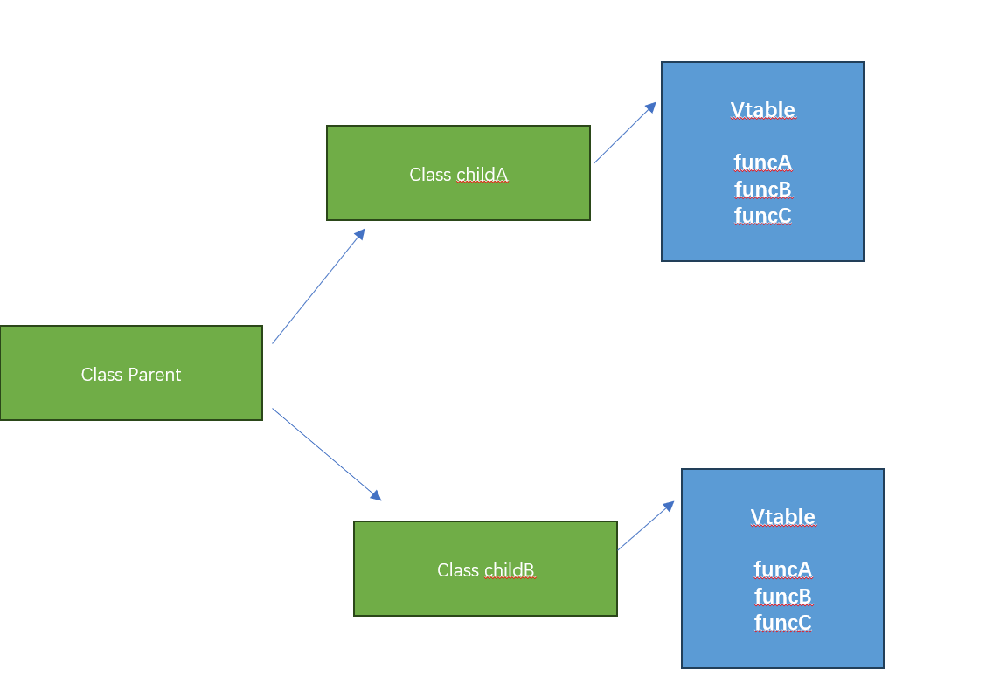

# 多态性

我们一开始讲过面向对象的继承以及RUST 为什么不愿意使用继承,继承中会大量用到多态的能力，让我们先尝试分析一下
传统面向对象语言中的多态实现 


### 静态分发

当执行一个类型的方法时，必须要知道该方法指向的函数地址(又叫函数指针)，访问某个类型的某个方法称之为分发

让我们回顾上一个小节的一段代码 
```
trait AnimalSound {
	fn sound(&self);
}

struct Cat;
struct Dog;

impl AnimalSound for Cat {
	fn sound(&self) { //假设该函数被声明为: Cat_AnimalSound_sound
		println!("miao miao");
	}
}

impl AnimalSound for Dog {
	fn sound(&self) { //假设该函数被声明为: Dog_AnimalSound_sound
		println!("wang wang");
	}
}

//主人拥有一个宠物
struct Master<T>{pet:T}

impl<T: AnimalSound> Master<T> {
	
	//主人可以命令宠物发声音
	fn command_sound(&self) {
		let Master{pet} =  self;
		pet.sound();
	}
}
//下面代码时编译器通过静态替换实现的 
struct Master<Cat>{pet:Cat}
impl Master<Cat> {
	
	//主人可以命令宠物发声音
	fn command_sound(&self) {
		let Master{pet} = self;
		//这里调用 Cat_AnimalSound_sound 
		pet.sound(); 
	}
}
//
fn main(){
	//当使用泛型时 RUST会声明静态的类型  
    let master = Master{pet: Cat};
    master.command_sound();
}
```

上述动作 在RUST 中叫做静态分发，一个典型的场景就是当一个类型 如果使用的特征有重名函数，必须使用完全限定语法 

```
// 定义两个特征
trait TraitA {
    fn shared_method(&self);
}

trait TraitB {
    fn shared_method(&self);
}

// 实现特征 TraitA 的结构体
struct MyStruct;

impl TraitA for MyStruct {
    fn shared_method(&self) {
        println!("TraitA's implementation");
    }
}

// 实现特征 TraitB 的结构体
struct AnotherStruct;

impl TraitB for AnotherStruct {
    fn shared_method(&self) {
        println!("TraitB's implementation");
    }
}

fn main() {
    // 创建结构体实例
    let my_instance = MyStruct;
    let another_instance = AnotherStruct;

    // 调用 TraitA 中的方法
    TraitA::shared_method(&my_instance);

    // 调用 TraitB 中的方法
    TraitB::shared_method(&another_instance);
}
```

### 动态分发

动态分发在C++ 和 JAVA 中被广泛使用，它允许一个类型(使用了接口 Interface)的时候 会采用动态分发

我们知道 RUST  trait 是一组函数指针的描述，该描述和 Interface 很像，先让我们看一下java 中的接口调用  




vtable 一般又叫做虚函数表，在编译阶段，当传入类型是Parent时候，无法知道实际的函数实现，只能在动态运行过程中，
通过遍历实际child类型的虚函数表，才知道函数地址

由于需要查找vtable 所以动态分发的方式需要更多的资源开销 


### 特征对象

这部分也可以在学习完 内存安全 以及 不定长对象之后再回来看

RUST 中的特征对象 被定义为： 丢失了/隐藏了具体真实类型的 trait实现的类型，此类型本身一般会实现了一组 trait。
几乎可以认为trait 对象描述 特征的对象，由于具体的函数指针列表 可能会因为 trait 不同，而具有不同的函数指针列表，
因此该对象是一个不定长对象(关于不定长对象 我们后面会讲 暂时理解为一个 类型，但是该类型的内存长度不是确定的)

使用特征对象，需要明确使用 'dyn trait_name' 表示类型，由于该类型的不定长，因此只能使用**引用** 或者是 放在智能指针里面使用

```
use std::fmt::Display;

//也可以使用 T:Display，但是这两种方式完全是不同的效果，一个是动态查找函数，一个是静态分发 
fn show_me(item: &dyn Display) {
	println!("{}",item);
}

fn main() {
	show_me(&32);
}
```

使用特征对象，会丧失原有类型的能力，只能使用 动态对象中的函数


