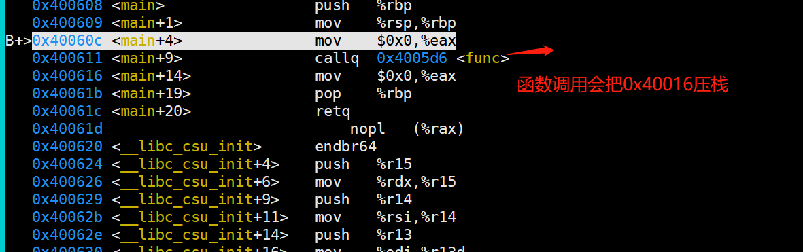
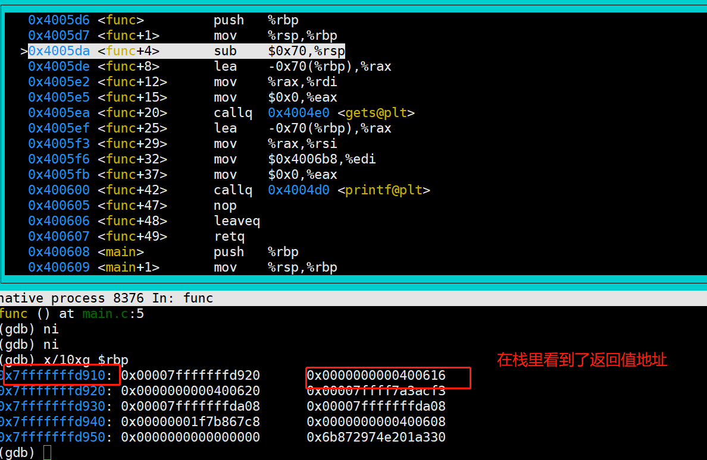
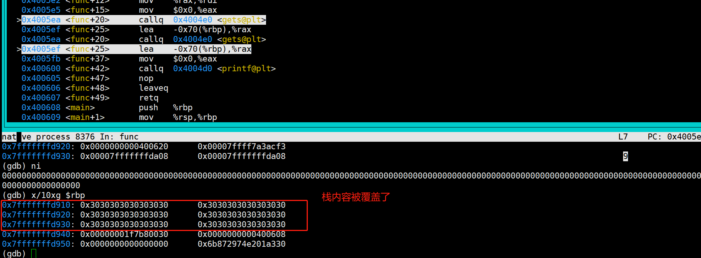

# 编程安全
本章我们会介绍最为常见典型编程安全问题，
只有理解这些，后面才能知道为什么RUST的目标以及为什么会流行

### 内存安全:stack overflow1

这是一个示例代码，我们尝试对其进行debug 看看会发生什么过程

```
#include <stdlib.h>
#include <stdio.h>

void func()
{
	char str[100];
	gets(str);

	printf("get str = %s \n",str);
}

int main()
{
	func();
	return 0;
}
```

我们尝试使用gdb调试一下: X86 callq 会执行压栈,函数返回地址会存储在栈顶




紧接着 我们进入函数，从下图，我们也可以得知新的函数得栈大小为 0x70,
并且变量str 也指向了栈得新地址；我们知道栈是向上增长得；




设想一下，如果我们写入字符串超过0x70(102bytes) 会发生什么



### 内存安全:stack overflow2

我们尝试修复第一个演示中的代码 

```
	struct Packet {
		int len;
		char *data;
	};

	void writePacket(struct Packet *p)
	{
		printf("packet:%s len is %d\n",p->data,p->len);
		char str[100]; 
		if (p->len < 100) {
			//snprintf第二个参数是size_t，是unsigned int; 这里发生了类型转换，就算检查成功，
			//负数会变成一个很大的无符号数
			snprintf(str, p->len, "%s", p->data);
		}
		printf("get str is %s\n",str);
	}
	
	int main()
	{	
		struct Packet p = {10, "123456789"};
		writePacket(&p);
		p.len = -1; //注意这里
		p.data = "00000000000000000000000000000000000000000000000000000000000000000000000000000000000000000000000000000000000000000000000000000000000000000000";
		writePacket(&p);
		return 0;
	}
```

尝试运行这段代码，依然会溢出,  

我们可以把上面的问题怪程序员吗？

 - 我们无法保证每一个编程人员都是优秀的程序员(基础理论很扎实，具备安全意识)
 - 无法保证优秀的程序员不会犯错：是的，常在河边走 哪有不湿鞋 

### 内存安全: UAF/DF/HEAP_OVERFLOW

下面代码演示了几种其他常见的内存安全问题

```
	#include <stdio.h>
	#include <stdlib.h>
	
	void stack_access(int stack_size, int access_size)
	{
		char str[stack_size];
		str[access_size] = 'a';
	}
	
	void heap_access(int alloc_size, int access_size) 
	{
		// allocate a heap mem
		char *str = (char *)malloc(alloc_size);
		// access heap mem overflow
		str[access_size] = 'a'; // maybe happend  stack  overflow
		free(str);
	}
	
	void user_after_free() 
	{
		// allocate a heap mem
		char *str = (char *)malloc(8);
		free(str);
		str[1] = 'a'; // happend  uaf
	}
	
	void double_free() 
	{
		// allocate a heap mem
		char *str = (char *)malloc(8);
		free(str);
		free(str);
	}
	
	int main()
	{
		//stack_access(10,9); // ok 
		//stack_access(10,10); // stack overflow 
		//heap_access(10,9); // ok 
		//heap_access(10,10); // heap overflow
		//user_after_free(); // heap overflow
		double_free(); // heap overflow
		return 0;
	}
```

### 解决内存安全
实际上，C/C++发展了这么多年，也产生了很多技术用以提前发现问题，整体上有两种思路: 

 - 动态检查: 在代码运行时检查,代表技术有： 地址消毒、valgrind
 - 静态检查: 在代码编译阶段、或者通过其他工具静态分析代码，代表技术: gcc -W选项；clang-tidy
 - 使用新的编程语言: 代表有 cyclone(一种安全的C语言变体)，甚至使用java这类 类型完备的上层语言 

#### 动态分析工具：valgrind

valgrind 主要用于监控堆内存，核心实现是对malloc/free wrap，这样程序堆上的内存都在他的监控之下，
从而可以判断程序对这些内存的合法使用,可以检查: 

 - 堆内存的非法访问(访问没有申请或者已经释放的内存 uaf)
 - 堆内存的重复释放(heap mem double free)
 - 堆内存泄漏(heap mem leak)

缺点:  

  - 由于只有程序对于堆的使用分析。比如统计出来有内存泄漏,但是无法明确知道内存泄漏原因，缺少程序信息
  - 无法监控栈上内存: 栈上的内存溢出、访问越界等问题无法发现(栈上的内存无法从程序推导，如果你看过汇编，
     栈上内存使用都是利用rbp + offset 使用，并没有人告诉我们这个内存是谁在使用，这个内存有效范围是多少)

####  动态分析工具：llvm Sanitizers
valgrind由于缺少源码信息，sanitizer 我们知道，他是LLVM 的一个工具，这个工具可以在编译阶段利用分析源码，
获得更多的信息，相比较valgrind 功能更加强大，可以用来发现栈上的内存问题 

 - addressSanitizer: 检测到内存越界、double free、uaf 等问题
 - leakSanitizer: 查找是否存在内存泄漏
 - MemorySanitizer：内存消毒，查找是否使用未初始化的内存
 - UndefinedBehaviorSanitizer： 查找是否存在空指针访问、整型越界
 - ThreadSanitizer： 线程并发相关
 
 
#### 静态分析工具：clang-tidy

静态扫描工具，原理就是分析源码，其中使用最为广泛的技术就是数据流分析

#### 缺点

动态分析最根本的问题在于: 

 - 只能够发现已经发生的问题
 - 如果程序依赖外部输入，并且外部输入的可能性非常多(常常是这样的 而且几乎等于无限种可能,
   我们预期的输入可能只是一个很小的范围，非预期的输入可能是无限的)，

一般我们需要利用FUZZ 和 动态分析工具一起使用；
FUzz通过随机输入，用以测试程序，FUZZ在生产环境是一个非常有效的工具，
但是还是有可能无法进入异常代码；随机并不等于一定会触发异常  

静态分析存在的缺陷是: 

 - 某段代码非常复杂(比如 存在while循环)，静态分析就会失效，为甚么? 如果静态分析把循环测试一遍 那不就等于是在运行程序了吗？开销太大
 - 会又可能产生误报，一些根本永远不可能存在的分支经常也会被统计进来
 
 
### 实验 

关于上文提到的几种技术，可以通过一个实验感受一下: 
通过实验学习这些工具并加深理解: 
https://reberhardt.com/cs110l/spring-2021/assignments/week-1-exercises/

### 安全问题根源
回归到本质；检测bug 是因为代码有bug，但是是否思考过 为什么代码会有bug? 

是否可以把责任都推到程序员的身上？

任何一个程序员(包括我)，我们的关注点在于 如何写出功能正常的代码；
但是黑客们的关注点是如何能找到这个代码的漏洞；

大家的精力分配是不相同的，如果C/C++程序员需要写出高质量高安全的代码，所需要付出的精力和开发效率的降低
是无法忍受的，而且由于语言自身相对宽松的约束，这些问题很难被发现 


### RUST 解决内存安全问题之道
 
 - RUST语言是安全的: RUST 是静态和强类型语言，并且RUST编译器通过增加编程(所有权)等原则 从原则上
  证明RUST的安全能力
  
 - RUST语言是性能良好的: 通过检查前置(编译时检查)、零成本抽象、内存栈优先分配等技术，保证运行效率
 
 - RUST语言是开发友好的: 通过结合已有的面向语言编程的特性、闭包特性、迭代器等特性，提升开发效率


